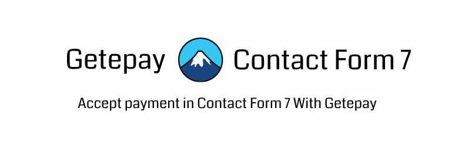

  

# Accept payment in Contact Form 7 by using Getepay.

### Description
This is a gateway extension for Contact Form 7 plugin to use Getepay Payment Gateway.

Payments are processed offsite at [Getepay](https://getepay.in) and the customer will be redirected back to your site after completing the payment.

### Changelog

#### 1.0.0 - January 07, 2024
* New: Option to send email confirmation on payment success.
* New: Enabled the ability to select multiple forms as payment forms.
* New: Introduced the new `geteapy_cf7_payment_success` action hook.
* New: Display current mode status (Live / Test) on the dashboard's admin bar.
* New: A payment redirect page will be automatically created and selected by default upon plugin activation.

### DISCLAIMER
*This project is not affiliated, associated, authorized, endorsed by, or in any way officially connected with Contact Form 7 or any of its subsidiaries or its affiliates. The official Contact Form 7 website can be found at https://contactform7.com. "Contact Form 7" as well as related names, marks, emblems and images are registered trademarks of their respective owners.*